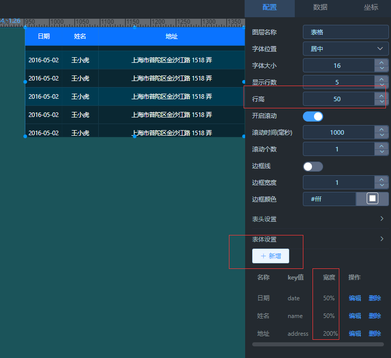
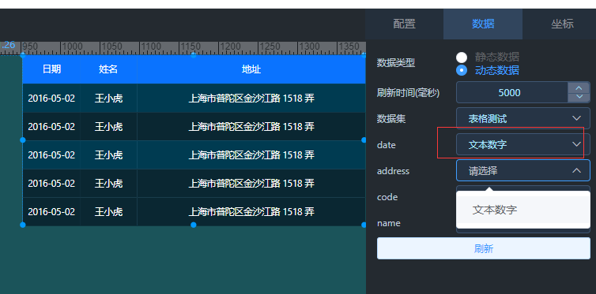
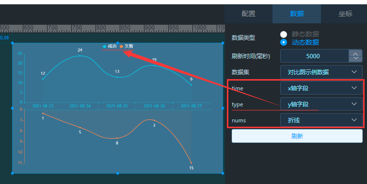

## 介绍
## 新增大屏

## 大屏简介

## 工具栏
### 文本框

### 滚动文本
已支持动态数据，请参考文本框的操作  

### 超链接
**如有问题，请提交 [Issue](https://gitee.com/anji-plus/report/issues)  **

### 当前时间
已支持多种时间格式，其他格式请提Issue  
  

### 图片
  

### 视屏
**暂不支持循环播放** 

### 内联框架
当超链接和视频链接无效的时候，请尝试使用内联框架 

### 表格
**存在问题，还在开发中** 

### 柱状图
柱状图数据集对应字典值需要选择一个“X轴”、“柱状”，只需要2个字段  
**如有问题，请提交 [Issue](https://gitee.com/anji-plus/report/issues)  **

### 柱状堆叠图
动态的数据集对应字典值需要选择一个“X轴”、“Y轴”、“柱状”，也就是说需要3个字段，不明白可以看看静态数据  
  
**如有问题，请提交 [Issue](https://gitee.com/anji-plus/report/issues)  **

### 折线堆叠图 
动态的数据集对应字典值需要选择一个“X轴”、“Y轴”、“折线”，也就是说需要3个字段，不明白可以看看静态数据  
  
**如有问题，请提交 [Issue](https://gitee.com/anji-plus/report/issues)  **

### 折线图
折线图数据集对应字典值需要选择一个“X轴”、“折线”，只需要2个字段  
  
**如有问题，请提交 [Issue](https://gitee.com/anji-plus/report/issues)  **

### 柱线图
柱线图数据集对应字典值需要选择一个“X轴”、“柱状”、“折线”，需要3个字段  
  
**如有问题，请提交 [Issue](https://gitee.com/anji-plus/report/issues)  **

### 饼图
饼图的数据集选择的时候，只能选择饼图对应的字典，即“Name”、“Value”，不明白可以参考静态数据  
  
  
  
**如有问题，请提交 [Issue](https://gitee.com/anji-plus/report/issues)  **

### 漏斗图
和饼图一样  
  
**如有问题，请提交 [Issue](https://gitee.com/anji-plus/report/issues)  **

### 仪表盘
数据集只能有一个字段，且字典选择“文本数字”  
  
**如有问题，请提交 [Issue](https://gitee.com/anji-plus/report/issues)  **

### 中国地图
**注**：气泡地图已支持动态数据，中国地图（迁徙图）暂不支持动态数据  
气泡地图动态数据集，和饼图一样，对应字典值需要选择一个“Name”、“Value”，且name的字段值要和echarts图表里面的值能对应上，可参考静态数据  
  

### 百分百图
数据集只能有一个字段，且字典选择“文本数字”  
  
**如有问题，请提交 [Issue](https://gitee.com/anji-plus/report/issues)  **

### 对比图
柱状对比图：  
数据集需要3个字段，其中一个作为对比的字段只能为2种值，只有2种值作为对比的字段要选择“y轴字段”字典。因为底层的解析用的是堆叠图的解析，这里的y轴字段并不是指的图表上面的y轴，还请注意，有强迫症可以自行修改源码的解析，剩下的2个字段对应字典看图 
  
**如有问题，请提交 [Issue](https://gitee.com/anji-plus/report/issues)  **

折线对比图:  
数据集需要3个字段，其中一个作为对比的字段只能为2种值，只有2种值作为对比的字段要选择“y轴字段”字典，剩下的字典对应看图 
  
**注**：如果提示语设置选择“十字形”，请注意需要选择 “X轴颜色、上Y轴颜色、下Y轴颜色”，不然预览图表鼠标选择是全白色，还请注意。 

**如有问题，请提交 [Issue](https://gitee.com/anji-plus/report/issues)  **
