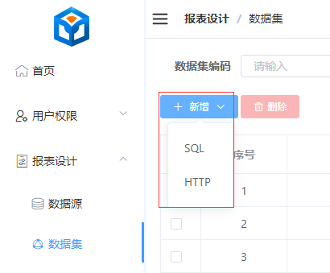
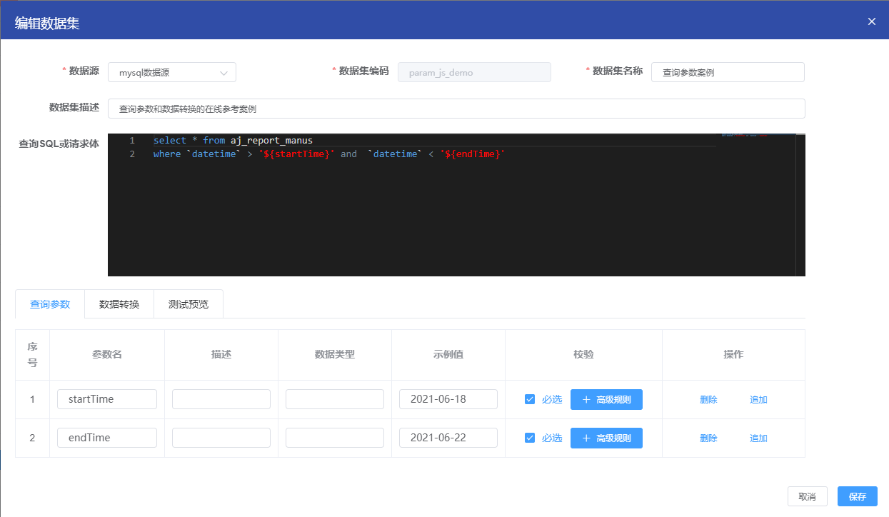
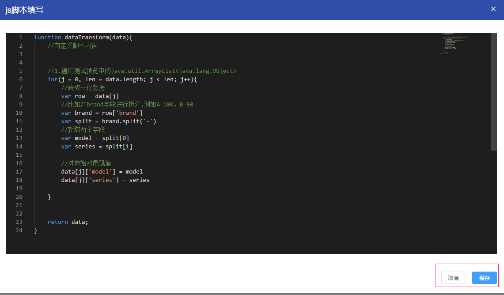

## SQL数据集

尽量不要使用 “select *”，以及展示很大的数据量，图表不一定能展示、页面可能会卡死  

### Mysql数据集

在数据源处添加了mysql的数据源后，即可使用。 
  

### ES数据集

**注**：es是通过调用xpack-sql，注意写法  
  

### Kudu数据集

  

## 功能栏

**可以看在线环境，有示例参考**  

### 查询参数

  
注意参数名要和sql(请求体)中变量名保持一致，sql(请求体)中的变量用 ${} 表示  
高级规则是用js进行数据装换。

### 数据转换

#### js脚本

**注**：这里的JS是java的scriptengine执行的，很多es6的语法不支持  
  
入参是data，返回值也必须是data，中间是JS的处理过程，注意入参返回都是List<JSONObject>，记得保存。  

#### 字典项

场景有限，待补充。

## HTTP数据集

即原有http数据源的功能，原有http数据源不动