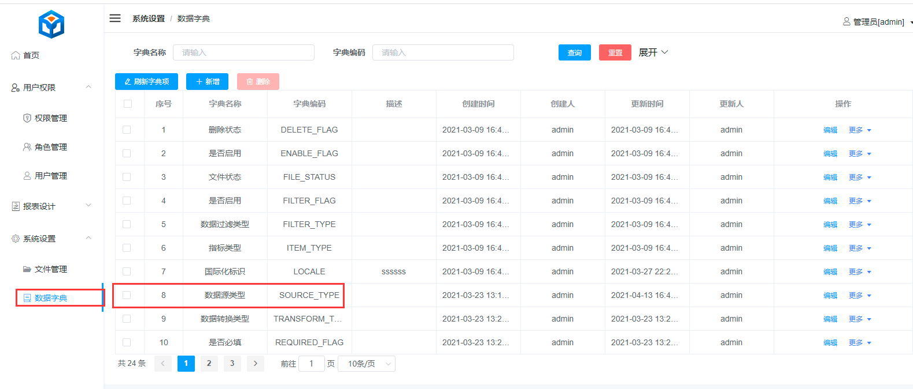
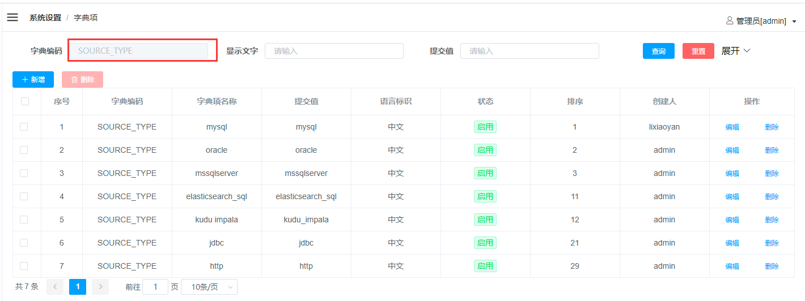

## 介绍

- 支持多数据源，内置mysql、elasticsearch、kudu等多种驱动 <br>
- 可动态扩展
  

## 数据源类型

查看已有的数据源类型 <br>
  <br>
  <br>

```text
可以在此页面进行新增数据源配置，也可以去数据库中增加你需要的数据源类型。
表aj_report.gaea_dict_item，字段dict_code：SOURCE_TYPE
表aj_report.gaea_dict_item, item_extend字段是下拉选择后动态表单渲染的json数据
```

## 操作

- 只有测试通过的数据源才可以保存
  

## 扩展

### JDBC驱动类数据源添加：

- 第一种，在report-core/lib目录下添加 <br>
  按照同样的层级将驱动包放置，使用build.sh脚本进行打包，前端页面选择jdbc数据源，填上对应的驱动类即可使用。<br>
  **注意：** 此方式添加的jar包只能使用build.sh进行编译后才会生效。<br>

<br>

- 第二种，在pom.xml中添加 <br>
  使用build.sh脚本编译或者maven package编译都可以，前端页面选择jdbc数据源，填上对应驱动。<br>

<br>

### 非JDBC类数据源驱动添加：

例如原生ES、Redis之类。<br>

1、在源码中编写解析代码 <br>
2、使用页面生成数据字典 <br>
3、添加对应驱动包<br>

  
  
