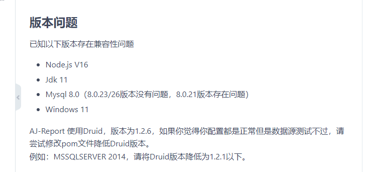

- 使用Maven Install打包时报错  
    
  请使用Maven Package进行打包  

-- 版本问题：[开发环境参考](https://report.anji-plus.com/report-doc/guide/quicklyDevelop.html)

- 底层数据库为Mysql8.0+时，flyway执行SQL报错 
- Node.js是V16版本时 npm install失败  
- jdk使用1.7或者11及以上时，编译打包不过  
    

- MssSqlServer 2014及其上下版本数据源测试不过。以2014版本为例。  
    
  将1.2.6改成1.2.0  

- 浏览器兼容性 当前未对部分浏览器做兼容性适配，推荐使用谷歌浏览器进行访问。 

- 部署完进入系统，点击预览大屏，大屏提示：**执行sql失败**  
    
  请先重置数据源的mysql连接，修改mysql的账号密码。 

- flyway执行报错1.0.10sql失败  
  错误提示：Caused by: org.flywaydb.core.api.FlywayException: Validate failed: Detected failed  
  migration to version 1.0.10 (create report share)  
  **注：0.93发行版及之后使用Report的小伙伴不用担心会出现此问题**  
  请参考此Issue解决此问题：https://gitee.com/anji-plus/report/issues/I47JNE  

- 禁用flyway及切换底层数据库方案  
  https://my.oschina.net/u/4517014/blog/5269319  

- 数据源数据集用法总结  
  https://my.oschina.net/u/4517014/blog/5270828  
  **注**：http数据源未来会挪到数据集那边  

- 执行编译脚本（build.sh）报错提示“*** No such file or directory”  
可能原因1：Node.js版本不是V14，导致前端编译失败  
可能原因2：Mvn版本过低，导致后端编译失败  

